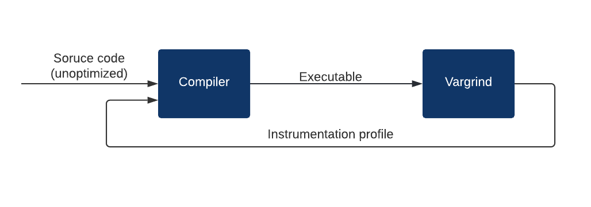
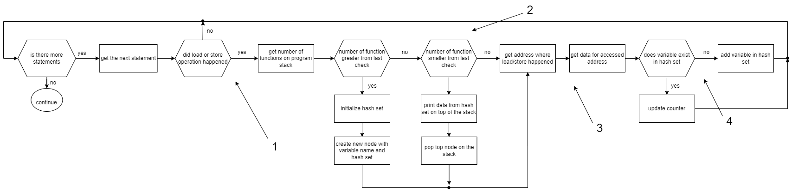
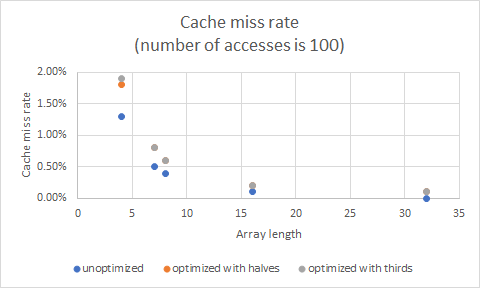
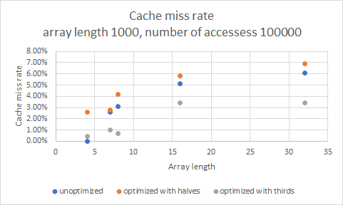
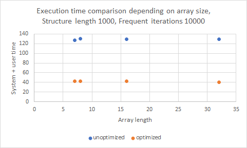
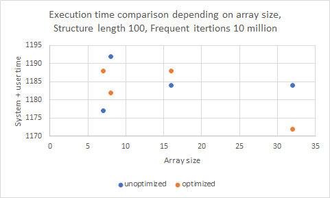
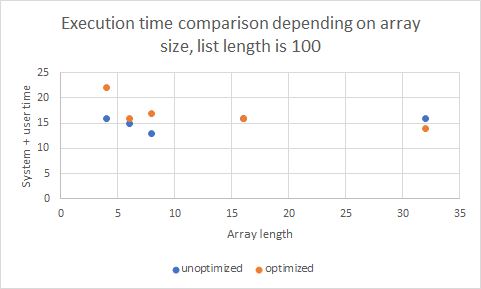
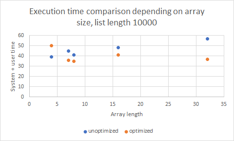

# Vargrind

## Introduction


The focus of this project was to improve the spatial locality, cache miss rate, and execution time of a program. For that purpose, a dynamic analysis tool named Vargrind has been created. It has been built upon Valgrind, a binary instrumentation framework (@valgrind). 

Vargrind tracks all addresses on which load or store operations were performed during the program's execution. Every address, if possible to obtain the information about it, has been linked with its name, the number of accesses to it, type, size, declaration file, and line number. The tool then gives information about addresses with their corresponding variables in the source code.

Information about the variables can be used to create an instrumentation profile that can be passed to the compiler to generate an optimized version (Diagram 1).



The instrumentation profile is created by analyzing the number of accesses to fields in the structures and their size. Therefore, it can be determined which variables in structures are used the most and which ones are not (by criteria explained in section ).

With all this information, a decision for structure reorganizing should be generated, removing less accessed elements (leaving a pointer to it) and keeping most accessed ones.

In this work, suggestions were made by observing usage presented in percentages. To test this optimization, further in the work synthetic tests have been written and analyzed.

## VEX IR

VEX represents a simple extended-basic-block compiler which in the first step of analysis decomposes the program in basic blocks (@vex). Basic block is a statement sequence with only one entry point and only one exit. VEX library turns assembly instructions into VEX IR (machine code -> IR -> Instrumented IR).

Example of generating one basic block represented in VEX IR from x86 assembly code:

```
                               add r1,r2,r3
    movl 4(ebp), eax           t10 = GET(4)        
    movl 8(ebp), ebx           t11 = GET(8) 
    leal (eax, ebx), ecx       t12 = Add32(t10, t11)      
```
*Code snippet 1.*

VEX is an intermediate representation format that abstracts away number of target machine languages and provides a uniform way to perform binary instrumentation.

This representation has four main classes of objects (@ir):

  * Expressions --- memory loads, register reads, results of arithmetic operations
  * Operations --- modification of IR expressions - integer and floating-point arithmetic
  * Statements --- which model changes in the state of the target machine, such as the effect of memory stores and register writes.
  * Blocks --- collection of IR Statements, extended basic block - IRSB or IR Super Block

The tool iterates trough every statement in IR Super Block and checks if that statement is a load or store operation. If it is, the address on which the load/store operation has happened and the size of the loaded/stored value are saved.

For example, this assembly instruction is translated to the following IR statement:

```

                    ------ IMark(0x4000ABA, 3, 0) ------
                         t3 = Add32(GET:I32(0),0x4:I32)  # get address of 4(%eax)
addl %edx,4(%eax)        t2 = LDle:I32(t3)               # load the value on that address
                         t1 = GET:I32(8)                 # get the value in register %edx
                         t0 = Add32(t2,t1)               # perform addition 
                         STle(t3) = t0                   # store the result on address 4(%eax)
```
*Code snippet 2.*

As stated above, Vargrind would track the load that happened in the second line in Code snippet 2 and the store operation on the 4th line of code.

## Implementation

The main part of the tool is `instrumentation`, where VEX IR is instrumented by inserting calls to implemented functions used to get data for variables (@valgrind_manual, pg. 138). First, IRSB (Intermediate Representation Super Block), without statements, is copied into the new one where calls will be added. Then, all statements are checked did load or store operation happen as shown on the diagram below, arrow 1 (Diagram 2). Load guarded and store guarded are also checked, but further in the work, they will be implied when load and store are mentioned. If one of these operations did happen, the next step is to check in which function did this call happen. The reason for this is to store data for the accessed variable in the appropriate table.


Tracking the last called function in the program is done by looking at the stack trace. Valgrind's function `get_StackTrace` is used to get this information (@stack_trace). Getting names of all functions from the stack is implemented based on Valgrind's `get_and_pp_StackTrace` function (@stack_trace). When the number of functions on the stack is collected, the tool checks if the new number of functions on the stack differs from the old count (or initial which is 0). If it does, `describe_IP` is used to get function name, address, and path to file where it's defined. 

To keep track of called functions, a stack is implemented. Nodes of this stack contain a function name (with its address and declaration line) and a hash set with data for variables accessed in that function.

If one or more new functions are called, a hash set for variable data is initialized for each of called functions (Diagram 2, arrow 2). Nodes are pushed on the stack in correct order, so function calls could be tracked. If there are fewer functions on the stack, functions are popped from the stack, data is printed and memory is freed.

Valgrind's built-in structure `VgHashTable` was used to implement hash set. To hash data, djb2 hash algorithm was used combined with `xor` instruction. Data passed to this algorithm ware all variable data. Hashing was done by getting djb2 hash code for each of variable information and then `xor` all hash codes. When this is done, result is passed to the djb2 hash algorithm once again.

When function checking is done, tracing of load/store operations continues so that data for an accessed variable can be gathered. This is implemented based on Valgrind's tool Lackey. Gathered data is used to check if the accessed variable already exists in the hash table. If it does, the counter for accessing that variable is incremented, and if it is not, then a new variable is added to the hash table.

The variable info is collected on every load/store operation during the program execution (Diagram 2, arrow 3). Additional information about the address on which the load/store operation has happened is obtained with Valgrind's `describe_addr` function. The function returns the `AddrInfo` structure with all the information regarding of the address. This structure is a tagged union, with a tag that refers to the type of the address or its location (variable, address on the stack, dynamically allocated address, address in .data segment, address in brk segment...)(@elf, @dwarf).

If the address is a variable, the `descr1` and `descr2` fields, two strings with description info, will be filled with all the variable information (is it global or local, file and line where it is initialized). By being strings that are internally preformatted by Valgrind's core, the information is extracted by splitting strings in words and associating them with their respected addresses in the node structure. 

The information that could be fetched about the address: size, type of variable, variable name, file, and line number where the address was declared.

Every time the number of called functions decreases, the hash table for the function that has ended (hence the function count on stack decreased) is being printed to the stderr and optionally to a file.

<br>



<br>


## Benchmark

The benchmark measures execution time and cache miss rate. Each test program has unoptimized and optimized version in terms of spatial locality. 

The optimization was made by analyzing the output from Vargrind, and reducing the structure size in unoptimized versions, by some of the following criteria:
  * remove from the structure all elements that were accessed less than k% time compared to most accessed element in that structure
  * remove from the structure all elements that were accessed less than average variable access

As shown in Code snippet 2, the unoptimized versions have a large array of numerous elements (1000000 in this case). Using the information provided by Vargrind, the first criteria can be applied (removing elements that were being accessed less than 90% times), therefore the structure in Code snippet 3 has been created. In this case structure contains only frequently accessed elements (a,b,c), and pointer to all other elements.

This dramatically reduces the structure size, in this case, from 8MB (`unoptimizedStruct`) to 32B (`optimizedStruct`).

<br>

```c++
    #define ARRAY_SIZE 1000000
    struct unoptimizedStruct{
        long array[ARRAY_SIZE];
    };
```
*Code snippet 2.*
<br>
<br>

```c++
    #define ARRAY_SIZE 1000000

    struct infrequentlyUsedElements{
        long array[ARRAY_SIZE - 3];
    };
    
    struct optimizedStruct{
        long a;
        long b;
        long c;
        struct infrequentlyUsedElements* structure;
    };
```
*Code snippet 3.*

<br>

After extracting elements from the structure, the both versions are benchmarked to determine if the new executable has better performance than the previous one.

All tests were run in Ubuntu 18.04 virtual machine. This virtual machine was limited to 50% of the host CPU (Intel(R) Core(TM) i5-10310U CPU, limited on 2 cores), one CPU core, and 1GB of RAM. For the purpose of time measurement, VM had isolated clock from the host machine. Time measurement was done using the bash `time` (@time) command, and for cache miss rate, `Cachegrind` (@cachegrind). In text below, size for `long long` is 8b.

Cachegrind is a cache profiler that simulates how the executable interacts with the machine's cache hierarchy. In most cases, Cachegrind simulates the first-level and last-level caches. Since the misses are of big importance, the L1 cache miss rate will be examined. 

The bash time command has three entries in its output: 
  * Elapsed real time 
  * Total number of CPU-seconds that process spent in user mode 
  * Total number of CPU-seconds that the process spent in kernel mode 

Linear congruential generator algorithm was used to access random elements. Parameter for the algorithm are shown in code snipped below (Code snippet 4).

``` c++
#define RAND_MAX ((1U << 31) - 1)
seed = (seed * 1103515245 + 12345) & RAND_MAX
```
*Code snippet 4.* 

<br>

## Results

### 1. Access only even elements

In the first group of the tests, the unoptimized version has a structure that contained an array of `long long` elements length `ARR_SIZE`. In the main program, an array of described structures is defined with the length of `STRUCT_LEN`. All elements of arrays for all structures were initialized.

`NUMBER_OF_RANDOM_ACCESSES_STRUCT` is a number of times that were accessed only elements with even indexes in array (of a random structure). In each iteration the product of two elements with even indexes was assigned to a random element in the array. Multiple random accesses were done to minimize caching of the data (Code snippet 5).

```c++
for (i=0;i<NUMBER_OF_RANDOM_ACCESSES_STRUCT;i++){
        for (j=2;j<ARR_SIZE - 2;j+=2){
            structures[rand()%STRUCT_LEN].array[j] = structures[rand()%STRUCT_LEN].array[j-2] * structures[rand()%STRUCT_LEN].array[j+2]; 
        }
    }
```

*Code snippet 5.*

The optimized version for this test had a statically allocated array, half the length of the previous array, for storing elements with even indexes from previous array. Aside from the array, the structure had a pointer that was assigned dynamically allocated memory for the elements removed from the structure (odd elements in array).

Both optimized and unoptimized version were tested with different values for parameters: `ARR_SIZE`, `STRUCT_LEN`, and `NUMBER_OF_RANDOM_ACCESSES_STRUCT`. The collected results are in the table below (Table 1).


<table>
<tr> <td rowspan="2">VARIABLES VALUES</td> <th colspan="2">CACHE MISS RATE</th> <th colspan="3">NORMALIZED TIME</th></tr>
<tr><td>unoptimized</td><td>optimized</td> <td>unoptimized</td><td>optimized</td><td>ratio (U+S)</td></tr>
<tr><td>AS = 4; SL=100; NS = 1000</td> <td>4.5%</td> <td>5.0%</td><td>R=4ms;U=0ms;S=2ms</td><td>R=5ms;U=0ms;S=3ms</td><td>1/1.50</td></tr>
<tr><td>AS = 7; SL=100; NS = 1000</td> <td>1.9%</td> <td>3.4%</td><td>R=17ms;U=0ms;S=14ms</td><td>R=5ms;U=0ms;S=3ms</td><td>1/0.21</td></tr>
<tr><td>AS = 8; SL=100; NS = 1000</td> <td>1.9%</td> <td>2.6%</td><td>R=17ms;U=0ms;S=15ms</td><td>R=4ms;U=1ms;S=3ms</td><td>1/0.27</td></tr>
<tr><td>AS = 16; SL=100; NS = 1000</td> <td>0.9%</td> <td>1.4%</td><td>R=20ms;U=0ms;S=17ms</td><td>R=3ms;U=0ms;S=2ms</td><td>1/0.18</td></tr>
<tr><td>AS = 32; SL=100; NS = 1000</td> <td>0.5%</td> <td>0.7%</td><td>R=19ms;U=0ms;S=16ms</td><td>R=8ms;U=0ms;S=6ms</td><td>1/0.37</td></tr>

<tr><td>AS = 4; SL=1000; NS = 1000</td> <td>4.1%</td> <td>3.1%</td><td>R=6ms;U=0ms;S=3ms</td><td>R=5ms;U=0ms;S=4ms</td><td>1/1.33</td></tr>
<tr><td>AS = 7; SL=1000; NS = 1000</td> <td>4.3%</td> <td>2.8%</td><td>R=17ms;U=0ms;S=13ms</td><td>R=4ms;U=0ms;S=2ms</td><td>1/0.15</td></tr>
<tr><td>AS = 8; SL=1000; NS = 1000</td> <td>4.9%</td> <td>3.1%</td><td>R=19ms;U=0ms;S=17ms</td><td>R=5ms;U=0ms;S=4ms</td><td>1/0.23</td></tr>
<tr><td>AS = 16; SL=1000; NS = 1000</td> <td>7.1%</td> <td>5.0%</td><td>R=19ms;U=0ms;S=16ms</td><td>R=6ms;U=0ms;S=4ms</td><td>1/0.25</td></tr>
<tr><td>AS = 32; SL=1000; NS = 1000</td> <td>8.6%</td> <td>6.9%</td><td>R=20ms;U=1ms;S=17ms</td><td>R=5ms;U=0ms;S=4ms</td><td>1/0.22</td></tr>

<tr><td>AS = 4; SL=1000; NS = 100000</td> <td>0.4%</td> <td>0.8%</td><td>R=5ms;U=1ms;S=3ms</td><td>R=7ms;U=0ms;S=5ms</td><td>1/1.25</td></tr>
<tr><td>AS = 7; SL=1000; NS = 100000</td> <td>3.7%</td> <td>0.1%</td><td>R=31ms;U=7ms;S=20ms</td><td>R=7ms;U=1ms;S=4ms</td><td>1/0.18</td></tr>
<tr><td>AS = 8; SL=1000; NS = 100000</td> <td>4.7%</td> <td>1.8%</td><td>R=31ms;U=7ms;S=22ms</td><td>R=12ms;U=1ms;S=7ms</td><td>1/0.28</td></tr>
<tr><td>AS = 16; SL=1000; NS = 100000</td> <td>7.5%</td> <td>5.5%</td><td>R=66ms;U=34ms;S=28ms</td><td>R=19ms;U=6ms;S=11ms</td><td>1/0.27</td></tr>
<tr><td>AS = 32; SL=1000; NS = 100000</td> <td>8.9%</td> <td>7.7%</td><td>R=131ms;U=94ms;S=33ms</td><td>R=37ms;U=21ms;S=14ms</td><td>1/0.28</td></tr>

<tr><td>AS = 4; SL=1000; NS = 150000000</td> <td>0.0%</td> <td>0.0%</td><td>R=610ms;U=580ms;S=25ms</td><td>R=653ms;U=625ms;S=25ms</td><td>1/1.07</td></tr>
<tr><td>AS = 7; SL=1000; NS = 150000000</td> <td>3.7%</td> <td>0.0%</td><td>R=20547ms;U=20276ms;S=145ms</td><td>R=3017ms;U=2977ms;S=23ms</td><td>1/0.15</td></tr>
<tr><td>AS = 8; SL=1000; NS = 150000000</td> <td>4.7%</td> <td>1.8%</td><td>R=11867ms;U=11711ms;S=92ms</td><td>R=5874ms;U=5836ms;S=24ms</td><td>1/0.49</td></tr>
<tr><td>AS = 16; SL=1000; NS = 150000000</td> <td>7.5%</td> <td>5.5%</td><td>R=21767ms;U=21581ms;S=123ms</td><td>R=19303ms;U=19224ms;S=41ms</td><td>1/0.89</td></tr>
<tr><td>AS = 32; SL=1000; NS = 150000000</td> <td>8.9%</td> <td>7.7%</td><td>R=48600ms;U=48741ms;S=334ms</td><td>R=40464ms;U=40318ms;S=56ms</td><td>1/0.82</td></tr>
</table>

*Table 1, results for access only even elements test*

*AS = ARR_SIZE, SL = STRUCT_LEN, NS = NUMBER_OF_RANDOM_ACCESSES_STRUCT, R-real time, S-system time, U-user time*

<br>

In the case when `ARR_SIZE` was assigned value 4, every structure had an array that can fit in the cache line without optimization, more precisely, two whole arrays could fit the cache line. Cache miss rate was less in the optimized version only when there were 1000 structures and 1000 function accesses. The execution time of the optimized version was worse in all cases.

In the case when `ARR_SIZE` was 7, one whole array could fit the cache line. That being said, there is additional space in cache line for a piece of the next structure. Besides that, optimization gave better performance in all cases except for the case when there were 100 structures and 1000 accesses. With these parameters, the cache miss rate was worse, but system time was 11ms faster. All other cases gave better results with optimization. Execution time was best when the array had 7, 8, 16 or 32 elements and there were defined 1000 structures.

### 2. Ascending access to elements

This test had the same structures as the test described above. The difference between these tests is in element accesses. In the main program, an *i-th* element in array in the structure was accessed *i* times. For every access, a random structure was chosen to prevent caching. This was repeated `NUMBER_OF_RANDOM_ACCESSES_STRUCT` times.

This test had two optimized versions:
* The first optimized version was done with the first optimization criteria with 50%. The array was split in half so that the latter half could be placed in the structure. Besides half of the original array, the structure contained a pointer to an allocated block of memory with the rest of the elements. 

* The second optimized version was done with the first optimization criteria with 33%. The array was split in thirds so that the last third of the array can be kept in a structure (the most used 33% of the array). Same as the second version, the new structure has a pointer to an allocated memory that contains the infrequently used elements.

```c++
for (i=0;i<NUMBER_OF_RANDOM_ACCESSES_STRUCT;i++){
        for (j=0;j<ARR_SIZE;j++){
            for (k=0;k<j;k++){
                structures[rand()%STRUCT_LEN].array[j] += 47*6/2;
            }
            
        }
    }
```

*Code snippet 6.*

<br>

For the small number of accesses, regardless of array length, both optimized versions gave the worse results for cache miss rate than unoptimized one (Chart 1). System execution time didn't cache the whole array had less than 8 elements (while it could fit in the cache line), and after that execution time, results were worse than for the unoptimized version.

When `NUMBER_OF_RANDOM_ACCESSES_STRUCT` increased, optimization that split the array in half gave the worse performance for both execution time and cache miss rate, then unoptimized one. Better performances gave splitting array in thirds (Chart 2).


{width="50%"} | {width="50%"}
--- | --- 
Chart 1. | Chart 2.

<br>

### 3. Infrequently accessed array elements

Similar to the tests above, these tests had macros `ARR_SIZE` and `STRUCT_LEN`. Beside stated macros, a new macro named `FREQ_ITERATONS` was defined. 

`FREQ_ITERATONS` refers to minimum number of times that last element of the array will be accessed in all of the structures. The regularly accessed variable in this case is the last element in the array. 

The optimized version has the new structure with extracted last element in the array and a new structure that has an array of size `ARR_SIZE - 1` (old array - the "hot element"). That allows the main structure to have one element and a pointer to the new structure (which will be dynamically allocated) that contains array with the rest of the elements.

Parameters `ARR_SIZE`, `STRUCT_LEN` and `FREQ_ITERATIONS` have been modified and results are in the table below (Table 2)


<table >
<tr> <td rowspan="2">VARIABLES VALUES</td> <th colspan="2">CACHE MISS RATE</th> <th colspan="3">NORMALIZED TIME</th>
<tr> <td>unoptimized</td><td>optimized</td> <td>unoptimized</td><td>optimized</td><td>ratio</td></tr>
<tr><td>AS = 7; SL=1000;  FI = 10000</td> <td>0.0%</td> <td>0.0%</td><td>R=129ms;U=93ms;S=34ms</td><td>R=45ms;U=30ms;S=13ms</td><td>1/0.34</td></tr>
<tr><td>AS = 7; SL=100; FI = 1000000</td> <td>0.0%</td> <td>0.0%</td><td>R=1183ms;U=1125ms;S=52ms</td><td>R=1196ms;U=1140ms;S=48ms</td><td>1/1.01</td></tr>
<tr><td>AS = 8; SL=1000; FI = 10000</td> <td>0.0%</td> <td>0.0%</td><td>R=133ms;U=95ms;S=35ms</td><td>R=45ms;U=31ms;S=12ms</td><td>1/0.33</td></tr>
<tr><td>AS = 8; SL=100; FI = 1000000</td> <td>0.0%</td> <td>0.0%</td><td>R=1200ms;U=1141ms;S=51ms</td><td>R=1180ms;U=1131ms;S=51ms</td><td>1/0.99</td></tr>
<tr><td>AS = 16; SL=1000; FI = 10000</td> <td>0.1%</td> <td>0.0%</td><td>R=132ms;U=97ms;S=32ms</td><td>R=45ms;U=30ms;S=13ms</td><td>1/0.33</td></tr>
<tr><td>AS = 16; SL=100; FI = 1000000</td> <td>0.0%</td> <td>0.0%</td><td>R=1193ms;U=1135ms;S=49ms</td><td>R=1194ms;U=1139ms;S=49ms</td><td>1/1.01</td></tr>
<tr><td>AS = 32; SL=1000; FI = 10000</td> <td>0.1%</td> <td>0.0%</td><td>R=131ms;U=95ms;S=34ms</td><td>R=42ms;U=28ms;S=12ms</td><td>1/0.31</td></tr>
<tr><td>AS = 32; SL=100; FI = 1000000</td> <td>0.0%</td> <td>0.0%</td><td>R=1190ms;U=1135ms;S=49ms</td><td>R=1179ms;U=1123ms;S=49ms</td><td>1/0.99</td></tr>
</table>
<em> Table 2, results for infrequently accesses elements in array</em>

<em>AS = ARR_SIZE, SL=STRUCT_LEN, FI = FREQUENT_OPERATIONS, R-real time, S-system time, U-user time</em>

In all runs of optimized programs when `STRUCT_LEN` was 1000, besides the cache rate being a bit lower (going in some instances from 0.1% to 0.0%), there is a significant decrease in all time measurement, compared to the unoptimized version in some cases: real by 25%, user 30%, and system time 35% (Chart 3). In the case when the number of structures was smaller and the number of `FREQ_OPERATIONS` was larger, the performance time was nearly the same, sometimes even slightly worse than in the unoptimized version (Chart 4).

{width="50%"} | {width="50%"}
--- | --- 
Chart 3. | Chart 4.


### 4. Sorting algorithms (Merge Sort)

For this test, two versions have been written. In the first version was, for element comparison, used only one element out of the array of data from the structure was used. In the second test, the first, middle, and the last element of an array of data in the structure was used.

For the first version of tests, a simple linked list was created. This list contained nodes type of the structure stated in tests above. After the initialization, the merge sort algorithm will be performed on the list. Only the "hot" variable is being accessed in the structure that also contains the array stated above. The `LIST_LEN` field in the header specified the length of the list that will be created.

In unoptimized version, the node structure contains the structure with a large array and a frequently used element that is used for comparing the two nodes (the array is not being accessed at all). 

```c++
struct Node {
    struct largeStructure largeStruct;
    struct Node* next;
};
```
*Code snippet 7.*

The optimized version extracts this "hot" variable and places it directly in the node and a new structures with  variables that were not accessed in the main structure is made. In the node, a pointer to the new structure is created (Code snippet 7).

```c++
struct Node {
    struct unusedStruct* unusedElements;
    int hot;
    struct Node* next;
};
```
*Code snippet 7.*

Parameters `ARR_SIZE` and `LIST_LEN` have been modified and results are in the table below (Table 3)

<table >
<tr> <td rowspan="2">VARIABLES VALUES</td> <th colspan="2">CACHE MISS RATE</th> <th colspan="3">NORMALIZED TIME</th></tr>
<tr> <td>unoptimized</td><td>optimized</td> <td>unoptimized</td><td>optimized</td><td>ratio</td></tr>
<tr><td>AS = 4; LL=100</td> <td>3.9%</td> <td>3.9%</td><td>R=48ms;U=0ms;S=16ms</td><td>R=56ms;U=0ms;S=22ms</td><td>1/1.37</td></tr>
<tr><td>AS = 4; LL=10000</td> <td>5.0%</td> <td>3.6%</td><td>R=106ms;U=10ms;S=29ms</td><td>R=93ms;U=14ms;S=36ms</td><td>1/1.28</td></tr>
<tr><td>AS = 7; LL=100</td> <td>3.9%</td> <td>3.9%</td><td>R=16ms;U=0ms;S=15ms</td><td>R=19ms;U=0ms;S=16ms</td><td>1/1.07</td></tr>
<tr><td>AS = 7; LL=10000</td> <td>5.5%</td> <td>3.6%</td><td>R=47ms;U=15ms;S=30ms</td><td>R=37ms;U=13ms;S=23ms</td><td>1/0.8</td></tr>
<tr><td>AS = 8; LL=100</td> <td>3.9%</td> <td>3.9%</td><td>R=14ms;U=0ms;S=13ms</td><td>R=18ms;U=0ms;S=17ms</td><td>1/1.30</td></tr>
<tr><td>AS = 8; LL=10000</td> <td>5.0%</td> <td>3.6%</td><td>R=42ms;U=14ms;S=27ms</td><td>R=37ms;U=13ms;S=22ms</td><td>1/0.85</td></tr>
<tr><td>AS = 16; LL=100</td> <td>3.9%</td> <td>3.9%</td><td>R=17ms;U=0ms;S=16ms</td><td>R=18ms;U=0ms;S=16ms</td><td>1/1</td></tr>
<tr><td>AS = 16; LL=10000</td> <td>5.0%</td> <td>3.6%</td><td>R=50ms;U=19ms;S=29ms</td><td>R=44ms;U=13ms;S=28ms</td><td>1/0.85</td></tr>
<tr><td>AS = 32; LL=100</td> <td>3.9%</td> <td>3.9%</td><td>R=17ms;U=0ms;S=16ms</td><td>R=16ms;U=0ms;S=14ms</td><td>1/0.87</td></tr>
<tr><td>AS = 32; LL=10000</td> <td>5.0%</td> <td>3.6%</td><td>R=59ms;U=22ms;S=35ms</td><td>R=38ms;U=13ms;S=24ms</td><td>1/0.65</td></tr>
</table>
<em> Table 3, results for infrequently accesses elements in array</em>

<em>AS = ARR_SIZE, LL=LIST_LEN, R-real time, S-system time, U-user time</em>

As the `ARR_SIZE` in the structure was increasing, the execution time started to decrease, when the AS was 32. For that particular case, the maximum execution time of the optimized program was slightly smaller than in the unoptimized program. While the cache miss rate stayed the same in cases when the `LIST_LEN` was 100, there was a significant drop in cache miss rate in the optimized version when the `LIST_LEN` was 10.000, going in some cases from 5.5% to 3.6% (1.9% decrease). As the size of structure and list grew, the decrease in execution time in the optimized version was bigger than in unoptimized, therefore in some cases going from 59ms to 38ms in real time (21ms decrease).

By further examining the charts, the difference in terms of performance between the optimized in optimized executables grew as both list length and array size were bigger. The results are shown below (Chart 5, Chart 6).

{width="50%"} | {width="50%"}
--- | --- 
Chart 5. | Chart 6.

The second version also had a simple linked list. Nodes of this list contained an array with all elements. For comparison, only the first, middle and last element of the array in a node was used. This was done to minimize the possibility to collect multiple data for comparison in one cache line. The optimized version of this structure contained three elements that are compared in one array, and to all other elements, the pointer was added to the structure. 
These tests had the following parameters:
  * `NUMBER_OF_ELEMENTS` - number of nodes in the linked list
  * `ARR_SIZE` - the size of the array that contains a structure (node)

The results obtained while modifying the parameters listed above are in the following table (Table 4).

For results when the list contained 1000 nodes, and array length was changed, the following chart (Chart 7) shows results. From this chart can be concluded that when the whole array can fit the cache line, optimization should be implemented to get a smaller cache miss rate. But, besides, worse cache miss rate, this optimization gave better execution time in all cases (Table 4).


<table>
<tr> <td>  </td>
     <td> <table><tr><td rowspan="2">array length</td><th colspan="3">time</tr>
     <tr><td>unoptimized</td><td>optimized</td><td>ratio</td></tr>
     <tr><td>4</td><td>R=16ms;U=0ms;S=15ms</td><td>R=10ms;U=0ms;S=9ms</td><td>1/0.6</td></tr>
     <tr><td>7</td><td>R=20ms;U=0ms;S=18ms</td><td>R=10ms;U=0ms;S=9ms</td><td>1/0.5</td></tr>
     <tr><td>8</td><td>R=19ms;U=0ms;S=17ms</td><td>R=6ms;U=0ms;S=6ms</td><td>1/0.35</td></tr>
     <tr><td>16</td><td>R=22ms;U=0ms;S=20ms</td><td>R=10ms;U=0ms;S=8ms</td><td>1/0.4</td></tr>
     <tr><td>32</td><td>R=20ms;U=0ms;S=17ms</td><td>R=10ms;U=0ms;S=6ms</td><td>1/0.35</td></tr>
     </table> </td>
</tr>
<tr><td>Chart 7.</td> <td>Table 4.</td></tr>
</table>


## Conclusion

After the analysis of the data provided by running the benchmark on synthetic examples, the hypothesis that was stated in the introduction was correct. The tool helped with pinpointing the variable/variables that was/were most frequently used throughout the program's execution, therefore providing guidance on how the code can be refactored, by checking the number of accesses to elements in the structure.

The comparison between unoptimized and optimized programs gave interesting insights. Firstly, the assumption was made that a structure could fit into the cache line when less frequently accessed elements were removed from it. That being said, the optimized version should provide better results regarding cache miss rate and execution time. 


# References


# Future work

The next big step should be implementing the instrumentation profile. Before that, more metrics should be tested, for example, other coefficients for percentage, or testing of fitting structure into the cache line. Besides that, the tool could be tested on some not synthetic programs and tests with threads.

For tool itself, few things should be modified. Output accesses for the same address in different functions should be outputted as a sum, not for every function separate. Besides that, pointers to dynamically allocated memory should be associated with appropriate memory addresses (or blocks). Further, tracking function calls should be changed, because this method can fail when between returning from one and calling another function neither store nor load operation happens.
